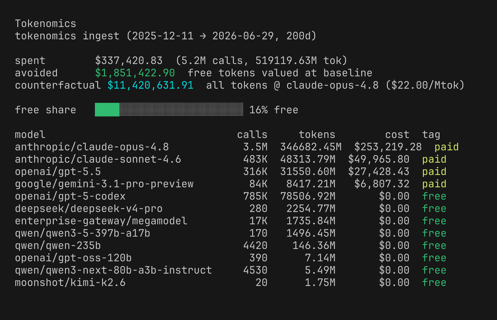

# tokenomics

**Unified LLM-spend ingestion engine + FinOps — one canonical ledger across Zoder, OpenClaw, Goose, and Hermes.**



*Example org spend (anonymized), enumerated by model across **paid AI tools** (Claude Code, Cursor, Codex) and **free open-weight models** served via an enterprise gateway: **$337,420 spent**, and routing the open-weight slice free **avoided $1,851,423** at a frontier baseline (16% of tokens ran $0).*

`tokenomics` is a host-neutral core (ledger → pricing → report → FinOps) plus thin
per-host ingestion adapters. Each host's native usage is mapped into one canonical
ledger row, so spend from different agent runtimes lands in a single report.

> Distributed on PyPI as **`ncz-tokenomics`**; the import package, the `tokenomics`
> command, and the Hermes plugin are all named `tokenomics`.

## Canonical ledger row

```
{ ts_utc, provider, model, tokens_in, tokens_out, cost_usd,
  caller?, task?, tier?, cache_hit_ratio? }   # last four = optional FinOps tags
```

Cost precedence is host-neutral: **host-reported cost → pricing-catalog estimate → $0** (never invented).

> **Subscription & OAuth billing (in progress).** Flat-rate tools — e.g. Codex on
> a ChatGPT subscription, or any provider accessed via an OAuth login rather than a
> metered API key — report **$0 per token**, so they currently surface as *free*
> even though a fixed subscription fee sits behind them. Subscription-aware cost
> modeling — OAuth- and API-key-based subscription support for OpenAI, Anthropic,
> MiniMax, and others — is on the roadmap, so the report can amortize those flat
> fees across real usage and reflect true effective cost.

## Hosts

| host | usage surface | cost | implementation · status |
|------|---------------|------|--------------------------|
| [**Zoder**](https://gitlab.com/ncz-os/zoder) (ZeroClaw fork) | in-process cost-tracker + offline pricing, inline | host cost else catalog | Rust, inline at the source · **shipped (v0.2.0)** |
| [**OpenClaw**](https://github.com/openclaw/openclaw) | `model.usage` event bus (`costUsd`), inline | host cost | native TypeScript extension · **PR #97149 (open)** |
| [**Goose**](https://goose-docs.ai/) (Agentic AI Foundation / Linux Foundation) | reads `~/.local/share/goose/sessions/sessions.db` | host (`accumulated_cost`) | this package — Python adapter + recipe · **shipped** |
| [**Hermes**](https://github.com/NousResearch/hermes-agent) (Nous Research) | reads `~/.hermes/state.db` | host (`actual_cost_usd`) → estimate → catalog | this package — Python adapter + `hermes tokenomics` plugin · **shipped** |

Zoder and OpenClaw emit the same canonical ledger rows *inline at the source* via
sibling implementations in their own languages/repos (see [Zoder](#zoder-zeroclaw)
and [OpenClaw](#openclaw)). Goose and Hermes are *pulled* read-only from their
existing stores by this Python package (no host modification).

## Install

```bash
pip install ncz-tokenomics
```

## CLI

```bash
tokenomics ingest --host goose  --ledger ledger.jsonl
tokenomics ingest --host hermes --ledger ledger.jsonl --pricing pricing.json
tokenomics report --ledger ledger.jsonl --days 30
tokenomics finops --ledger ledger.jsonl --days 30
```

## Zoder (ZeroClaw)

ZeroClaw's cost accounting is delivered through **[Zoder](https://gitlab.com/ncz-os/zoder)**.

**What Zoder is:** the full-stack developer's AI pair-coding and headless
coding-dispatch system — **free-first, cost-governed, MNEMOS-first**. It's to
[ZeroClaw](https://github.com/zeroclaw-labs/zeroclaw) what Ubuntu is to Debian: a
curated, opinionated distribution on the same engine, tuned for two jobs —
(1) interactive pair-coding at the terminal (the `zerocode` TUI), and (2) headless
automated coding dispatch (a *hive* of worker agents that pick up coding tasks, run
them on the cheapest capable model, review, fix, and report cost — no human in the
loop). It **routes to free / open-weight models first**, refuses to silently fall
back to a paid backend, and is vendor-neutral against any OpenAI-compatible / LiteLLM
endpoint.

Because cost-governance is core to Zoder, the tokenomics integration ships **inside
Zoder** as Rust — an offline pricing catalog plus a cost-tracker hook in the
runtime, vendored on the `zoder-integration` branch of the ZeroClaw fork —
emitting the same canonical ledger rows inline at the source (cost is the
host-reported value, else the offline catalog).

- **Zoder:** https://gitlab.com/ncz-os/zoder · mirror https://github.com/ncz-os/zoder · [releases](https://gitlab.com/ncz-os/zoder/-/releases)
- **ZeroClaw fork (patch stack):** https://gitlab.com/ncz-os/zeroclaw (`zoder-integration`)

## OpenClaw

[OpenClaw](https://github.com/openclaw/openclaw) is supported by a **native
TypeScript extension** (`extensions/tokenomics`) inside OpenClaw — not a Python
adapter in this repo. It subscribes to OpenClaw's
internal `model.usage` event bus and persists each invocation's `costUsd` into the
same canonical ledger, then serves a spend report and a FinOps view (`?view=finops`).

By design it does **not** duplicate OpenClaw's pricing catalog — it consumes the
`costUsd` OpenClaw already emits, which keeps it lightweight and provider-agnostic.

Status: PR open — https://github.com/openclaw/openclaw/pull/97149 (needs a
maintainer override since it introduces dependencies).

## Goose

[Goose](https://goose-docs.ai/) (the [Agentic AI Foundation](https://github.com/aaif-goose/goose)
agent, under the Linux Foundation) has no operator plugin command, but it persists
per-session usage **and cost** to its own SQLite store, so the CLI reports Goose
spend directly:

```bash
pip install ncz-tokenomics
tokenomics ingest --host goose --ledger ~/.local/share/goose/tokenomics-ledger.jsonl
tokenomics report --ledger ~/.local/share/goose/tokenomics-ledger.jsonl --days 30
tokenomics finops --ledger ~/.local/share/goose/tokenomics-ledger.jsonl --days 30
```

Cost is host-authoritative (Goose's `accumulated_cost`); ingest is idempotent
(dedupes already-seen sessions), so it's safe to re-run.

### Recipe (agent-driven)

`recipes/goose-tokenomics.yaml` packages the above as a Goose recipe — the agent
installs the CLI if needed, ingests, and presents the report:

```bash
goose run --recipe recipes/goose-tokenomics.yaml --params days=30
```

## Hermes plugin

Adds a `hermes tokenomics` command that reports spend from Hermes's own session
store (`~/.hermes/state.db`). Read-only; no Hermes core changes.

**Hermes plugins are opt-in — you must `enable` after installing, or nothing loads.**

**Install (either method):**

```bash
# A) drop-in — environment-independent, recommended
hermes plugins install ncz-os/tokenomics

# B) pip — install into the SAME environment the `hermes` CLI runs from
pip install ncz-tokenomics
```

**Then enable + restart (required):**

```bash
hermes plugins enable tokenomics   # opt-in gate — without this the command won't appear
hermes gateway restart             # for the gateway/TUI; the CLI works immediately
```

**Use:**

```bash
hermes tokenomics            # sync ~/.hermes/state.db -> ledger, print spend report
hermes tokenomics --finops   # FinOps view (allocation / realized-rate / advisor / forecast)
hermes tokenomics --ingest-only
```

(Alternatively, enable via `~/.hermes/config.yaml`: `plugins: {enabled: [tokenomics]}`.)

## License

Apache-2.0 © Jason Perlow
